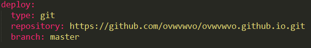

#hexo使用
##1.安装node.js(略过) 参考[官方文档](https://nodejs.org/en/)

##2.安装hexo 

### 2.1安装命令 	`npm install hexo-cli -g`

	介绍几个常用的命令 

   - 初始化一个项目 `hexo init <fileName>`

   - 安装项目依赖 `cd <fileName> && npm install`
   
   - 生成静态文件 `hexo generate` 或 `hexo g`

 	- 启动项目  `hexo server` 或 `hexo s`
   
   - 一键部署 `hexo deploy` 或 `hexo d`
   
###下面说几个需要注意的地方

 一键部署需要另外安装模块，比如部署到github就需要安装 hexo-deployer-git 模块,执行
`npm install hexo-deployer-git --save`就安装到本地了，之后打开 -config.yml，配置如下图。也可以把这个配置到项目的 package.json 文件里，这样移动项目就不用每次都安装。这里就不细讲了，需要了解可以去学习一下 node.js 的包管理。 这里附上[deploy使用说明](https://hexo.io/zh-cn/docs/deployment.html)

国内有时候连不上npm或者连得上但是下载很慢，这里推荐使用[cnmp](http://npm.taobao.org/)(淘宝NPM镜像).
执行这个命令
`npm install -g cnpm --registry=https://registry.npm.taobao.org`
之后，npm会帮你安装 cnpm 模块，以后再执行 npm 命令时，使用 cnmp 代替 npm 就可以了。

###现在执行 `hexo s` 打开浏览器输入 `localhost:4000` 就可以看到你的blog了。 

